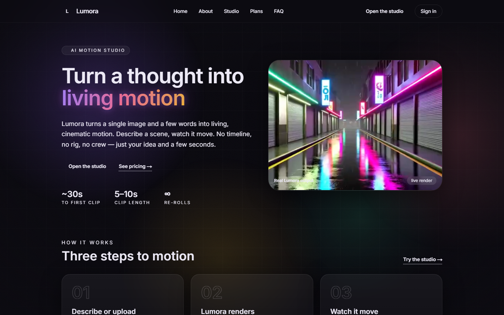
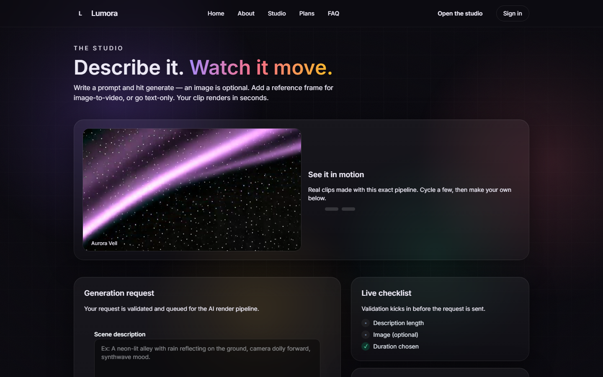
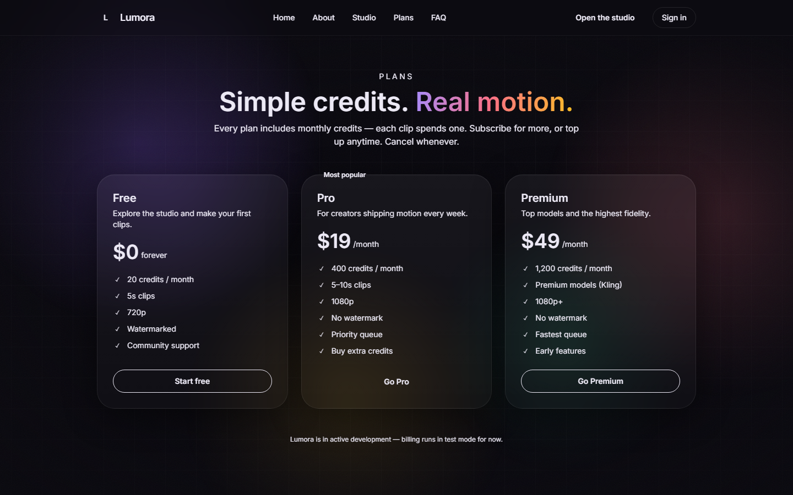

# Lumora — Imagination in motion

Lumora is an AI **image + text → video** SaaS. Upload a still frame (or just describe a scene), set the mood and motion in one prompt, and an async pipeline renders a short cinematic clip in ~30 seconds.



| Creation studio | Plans |
|---|---|
|  |  |

## Features

- **Image-to-video & text-to-video** generation via [fal.ai](https://fal.ai) models (Kling / LTX)
- **Async render pipeline** — jobs are queued, rendered by an n8n-orchestrated workflow, and delivered through a signed callback
- **Auth & accounts** — NextAuth (Google OAuth), per-user video library
- **Hybrid monetization** — subscription plans (Free / Pro / Premium) + buyable credits
- **Pluggable storage** — local disk in dev, S3-compatible (MinIO / Cloudflare R2) in production
- Landing, plans, FAQ, about, account, and a full creation studio UI

## Stack

| Layer | Tech |
|---|---|
| Frontend | Next.js 14 (App Router), TypeScript, Tailwind CSS v4 |
| Backend | Next.js API routes, Prisma ORM, PostgreSQL |
| Auth | NextAuth.js |
| Video generation | fal.ai (image-to-video / text-to-video) |
| Orchestration | n8n (Docker) |
| Storage | local / MinIO / Cloudflare R2 (S3 API) |
| Infra | Docker Compose |

## Getting started

```bash
npm install
cp .env.example .env.local   # fill in DATABASE_URL, NEXTAUTH_SECRET, FAL_KEY...
npx prisma migrate dev
npm run dev
```

Open [http://localhost:3000](http://localhost:3000).

Optional services (n8n + MinIO) run via `docker-compose up -d`. The app also works without them using the built-in stub video provider (`VIDEO_PROVIDER=stub`) — no API key needed.

## Project docs

Architecture decisions, data model, roadmap, and changelog live in [`docs/`](docs/):

- [`docs/VISION.md`](docs/VISION.md) — product, audience, business model
- [`docs/ROADMAP.md`](docs/ROADMAP.md) — phases & milestones

## License

All rights reserved © Bogdan Mihailov.
